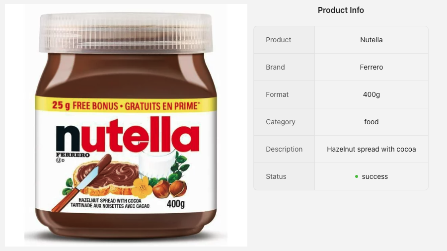

# Description
This project demonstrate how to use a lambda function to extract information from a picture using generative AI.
To achieve that, we use Claude v3 Sonnet inside Bedrock to provide vision capability.




# What's inside?
This is code sample that uses the AWS Cloud Development Kit (CDK) to:
* Create an APi Gateway to handle request
* Create a policy for the Lambda to call bedrock API and S3
* Create a node.js Lambda function that can be invoked using API Gateway
* Create an S3 bucket to save the picture


# How do I start using it?
1. Ensure you've followed the [guide to Getting Started to AWS CDK](https://docs.aws.amazon.com/cdk/latest/guide/getting_started.html), and you have CDK installed, and the AWS SDK installed and credentials configured. 
2. In the root folder, [Bootstrap your AWS environment](https://docs.aws.amazon.com/cdk/latest/guide/serverless_example.html#serverless_example_deploy_and_test) with `cdk bootstrap`
3. Build the stack with `npm run build`
4. Deploy the  stack with `cdk deploy`
5. When deployment is complete, you will see in the Output (in your terminal or in the Cloudformation console) the path to your `CDKImageDescriptionStackRestApiEndpoint` (it is your Api gateway endpoint)

# Test
After you deployed your Cloud formation with CDK, you can make query using your favorite tool ( Postman, cli, etc...)
Here is an example using the command line :
```
curl -X POST \
     -F "productImage=@/path/to/picture.jpg" \
     https://your-apigateway-endpoint-from-step-5
```


# About the frontend

There is a frontend in React you can play with in the `/public/frontend` folder.
It is just uploading a picture to the backend that have been deployed in the step 5.
*Note* : The React app is not part of the CDK deployment, but you can play with it locally like:
```
cd public/frontend
npm install
npm start
```

You will have to change the endpoint in `App.js` to match your api-endpoint (output in step 5)